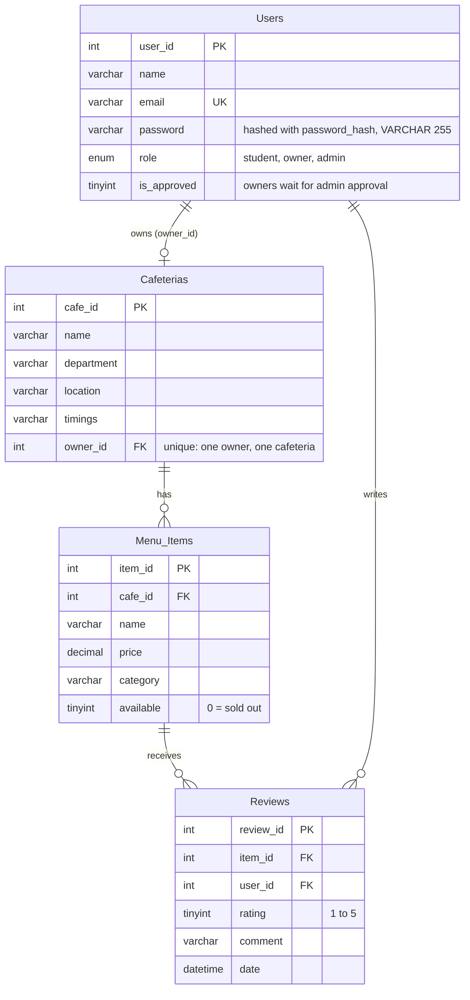

# Fork & Find - ER Diagram

```mermaid
erDiagram
    Users ||--o| Cafeterias : "owns (owner_id)"
    Cafeterias ||--o{ Menu_Items : "has"
    Menu_Items ||--o{ Reviews : "receives"
    Users ||--o{ Reviews : "writes"

    Users {
        int user_id PK
        varchar name
        varchar email UK
        varchar password "hashed with password_hash, VARCHAR 255"
        enum role "student, owner, admin"
        tinyint is_approved "owners wait for admin approval"
    }
    Cafeterias {
        int cafe_id PK
        varchar name
        varchar department
        varchar location
        varchar timings
        int owner_id FK "unique: one owner, one cafeteria"
    }
    Menu_Items {
        int item_id PK
        int cafe_id FK
        varchar name
        decimal price
        varchar category
        tinyint available "0 = sold out"
    }
    Reviews {
        int review_id PK
        int item_id FK
        int user_id FK
        tinyint rating "1 to 5"
        varchar comment
        datetime date
    }
```

Rules: one review per student per menu item (a second submit updates it). A cafeteria has at most one owner.
